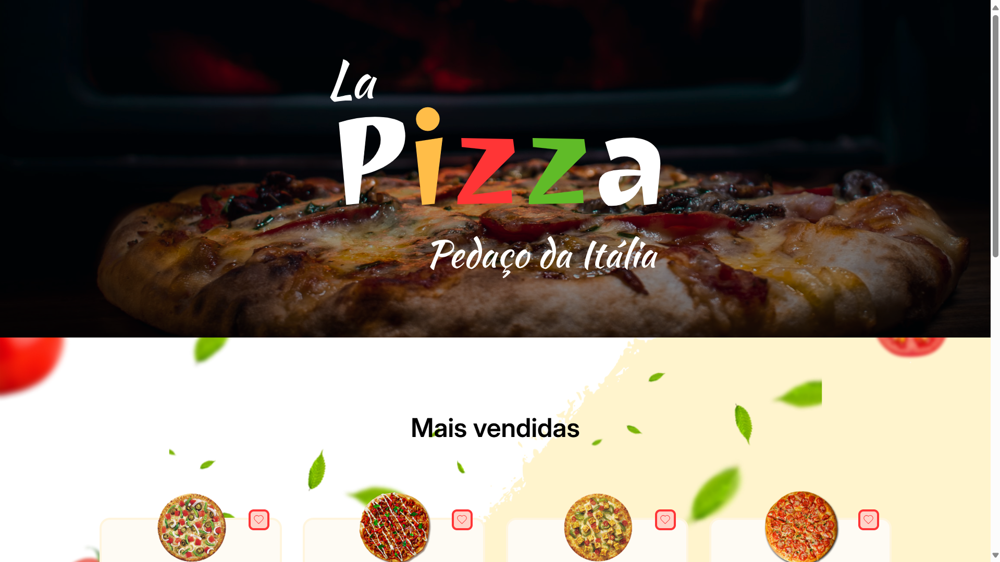

# La Pizza

> Status : Finished project ✅ / Open PR

## Challenge [08] CodeLab - Iuri Silva
>Look the design: https://www.figma.com/design/Yb9IBH56g7T1hdIyZ3BMNO

 
*Technologies*

+ ReactJS ⚛️ 
+ Vite 🚀
+ Styled-components 💅 
 
### How to use
 
- git clone https://github.com/12Gustavo21/LaPizza.git or download the zip
- npm install or yarn install
- code . (if you use VSCode)
- npm start or yarn start

 ## 💻 Online Page: https://la-pizza-codelab.vercel.app

## 🌐 Contact me:
 
